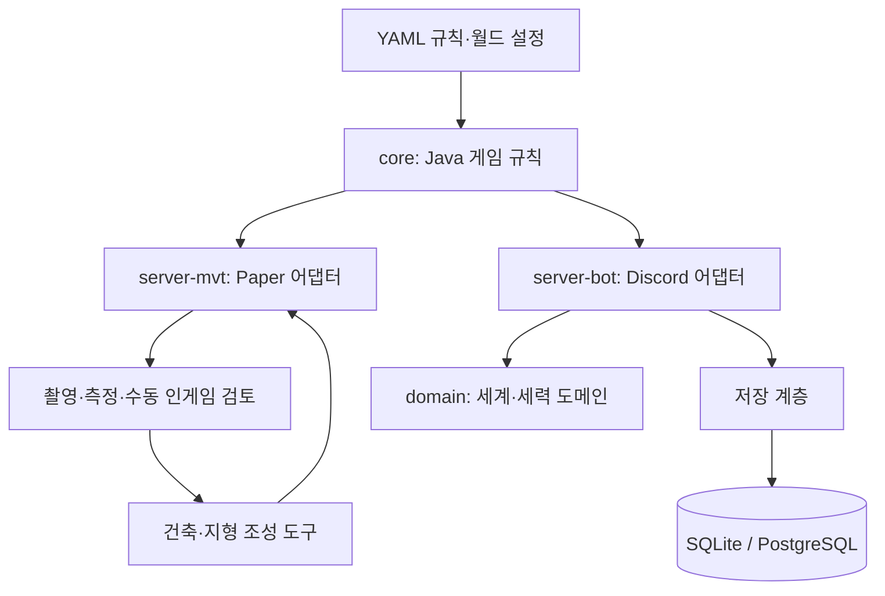

# 혼천 — Minecraft 기반 무협 RPG 오픈월드

**Active Development** · AI-assisted world generation · 게임 규칙 / 세계 상태 / 저장 계층

플레이어의 행동이 세계에 누적되는 무협 RPG를 개발합니다.
게임 규칙과 서버 표현을 분리하고, 개발자가 의도한 건축·지형을 AI와 생성 도구로 만든 뒤 실제 게임 화면과 검증 도구로 반복 확인합니다.

## 지금 확인할 수 있는 범위

아래의 “구현”은 공개 저장소에 코드와 검증 진입점이 있다는 뜻입니다. 전체 오픈월드 완성이나 상용 운영 완료를 뜻하지 않습니다.

| 단계 | 범위 | 근거 |
| --- | --- | --- |
| **구현 완료 — 개별 모듈** | 순수 Java 게임 규칙, Paper 테스트 서버 플러그인, Discord 플레이 어댑터 | [core](core/src/main/java/com/honcheon/core/rules), [server-mvt](server-mvt/src/main/java/com/honcheon/mvt), [server-bot](server-bot/src/main/java/com/honcheon/bot) |
| **구현 완료 — 저장·상태 계층** | 세계 시계·지역·세력 반응, SQLite/PostgreSQL 저장 구현과 스키마 | [세계 시계](server-bot/src/main/java/com/honcheon/bot/WorldClockEngine.java), [세계 저장](server-bot/src/main/java/com/honcheon/bot/WorldStore.java), [DB 스키마](db) |
| **실험 중** | AI-assisted world generation, 건축 형태·바닥·지형의 분리 생성, 레퍼런스 기반 반복 개선 | [조성 코드](server-mvt/src/main/java/com/honcheon/mvt/forge), [화산 조성 기록](docs/design/hwasan/README.md) |
| **실험 중** | 접속 중인 봇/클라이언트 확인, 촬영·측정·시각효과 검토 자동화 | [사전 점검](scripts/vfx_preflight.py), [검토 루프](scripts/vfx_loop.py), [촬영 도구](scripts/kigi_cam_test.py) |
| **설계 완료 — 문서 범위** | 세계 반응·지속 세계의 목표와 규칙을 문서화 | [설계 문서](docs/design) — 이후 수정과 구현 검증이 필요 |
| **예정** | 전체 월드 콘텐츠 통합 및 장기·다중 플레이 검증 | 개별 모듈의 구현을 전체 완료로 간주하지 않음 |

## 문제와 내가 한 일

설정이 많은 RPG에서 규칙·서버 표현·세계 상태가 뒤섞이면 한 변경이 어디에 영향을 주는지 확인하기 어렵습니다.
게임 규칙을 `core`에 두고 Paper와 Discord를 어댑터로 연결하며 저장 계층과 설정 파일을 분리했습니다.

AI가 생성한 건축·연출은 의도와 게임 안에서 보이는 결과가 다를 수 있습니다.
건축물과 바닥·지형 생성 단계를 나누고 레퍼런스와 인게임 결과를 비교하면서 조성 코드와 검토 도구를 함께 개선했습니다.
공개 코드의 시각효과 검토 루프를 **모든 건축물의 생성→봇 접속→시각 평가가 완전 자동화된 기능**으로 확대해 설명하지 않습니다.

## Architecture · 기술 선택



- **Java / Paper**: Minecraft 이벤트와 표현을 게임 규칙에서 분리합니다.
- **YAML**: 규칙·월드 설정을 코드와 별도로 관리하고 패리티 테스트에서 읽습니다.
- **SQLite / PostgreSQL**: 저장 구현과 전환 검증 코드를 함께 둡니다. 두 DB를 모두 대규모 운영했다는 뜻은 아닙니다.
- **Python 도구**: 조성 결과·설정·영속화 경계를 검사하고 반복 작업을 자동화합니다.

## 테스트와 실행 조건

Java 21 환경과 의존성 다운로드가 가능한 네트워크가 필요합니다.

```bash
./gradlew :core:test
./gradlew :server-mvt:build :server-bot:build
```

- [core 테스트](core/src/test/java/com/honcheon/core/rules): 판정·성장·세계 반응 등 규칙 검증.
- [검증 도구](tools): 영속화·월드·조성 관련 Python self-test와 Java SelfTest. 모든 도구가 Gradle test에 자동 포함되는 것은 아닙니다.
- [GitHub Actions](.github/workflows/launcher.yml)는 **Windows 런처 빌드**를 다룹니다. 서버 전체의 테스트 CI로 소개하지 않습니다.
- 서버 실행에는 Paper, 월드·리소스팩, 로컬 설정이 추가로 필요합니다. [MVT 실행 스크립트](scripts/run_mvt_server.sh)와 [봇 실행 스크립트](scripts/run_bot.sh)를 확인하세요.
- 봇/클라이언트·RCON·촬영 환경이 필요한 검증은 실제 실행 환경에서 확인해야 합니다. 이번 README 정리에서 전체 월드 E2E를 재실행하지 않았습니다.

## AI-assisted development와 현재 한계

AI agent를 코드·건축 후보 생성과 반복 작업에 활용합니다.
개발자는 요구사항·설계 판단·코드 리뷰·테스트·실제 화면 검토를 담당합니다.

현재는 개별 기능 구현과 월드 조성 실험을 이어가는 단계입니다.
설계 문서의 범위, 로컬에서만 진행한 실험, 공개 기본 브랜치의 구현은 서로 구분합니다.

[전체 문서](docs) · [설정](config) · [포트폴리오](https://gwangwon.dev)
